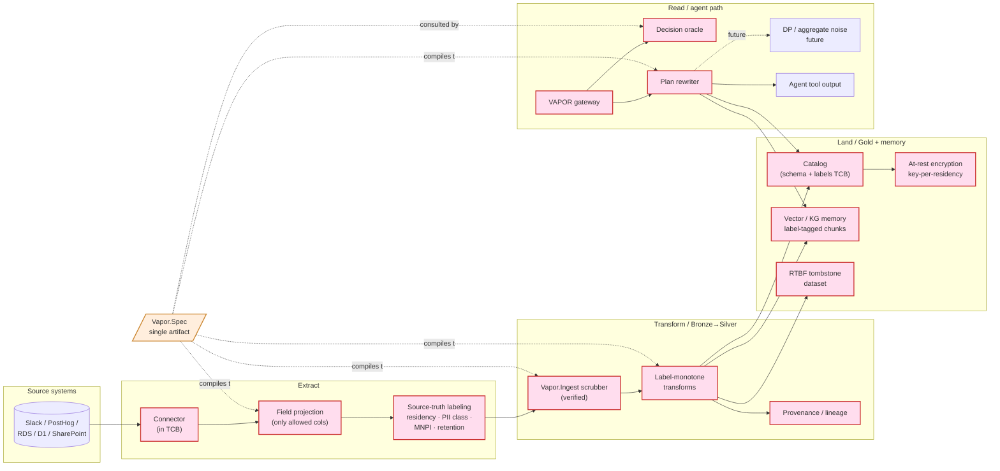

# End-to-end privacy through the ETL pipeline

> *How VAPOR keeps privacy guarantees attached to data from extract →
> bronze → silver → gold → agent read, without the gateway being
> retroactively defeated by something an earlier ETL stage did.*

## The problem in one paragraph

The gateway is only the last line of defense. By the time an agent
issues a query, the data has already been *extracted* from a source
system, *labeled* (or mis-labeled) by a connector, *transformed*
through one or more silver stages, possibly *embedded* into a vector
index, and *cached* in staging buffers along the way. Each step is a
TCB component and each step can defeat the gateway's downstream
checks if it (a) over-fetches, (b) drops or weakens labels, (c)
introduces a derived column that leaks, or (d) leaves a copy outside
the policy-aware path. **E2E privacy means the policy is enforced
*continuously* across all of these stages, not just at the gateway.**

VAPOR's principle: **one policy artifact (`Vapor.Spec`) compiles to
enforcement at every tier**. Read-side rewrite and write-side ingest
filter are the same source artifact targeting different stages — and
their *observational equivalence* is the load-bearing Lean theorem
(`Ingest.compose`).

## E2E flow with privacy boundaries (Mermaid)

Pink = TCB. Yellow = the single source-of-truth policy that drives
every TCB component. The architectural claim is that **every arrow
into a TCB component derives from the same `Vapor.Spec`**, and the
`Ingest.compose` theorem makes the equivalence between the ingest and
read paths mechanical, not hopeful.

## Twelve controls, mapped to VAPOR primitives

Each control names: **what** it defends, **how** VAPOR expresses it,
**status** (shipped in scaffold / planned / future).

### 1. Source-truth labeling at extract (`status: planned`)

**Threat:** the source system knows facts (Slack channel privacy,
PostHog GDPR flag, RDS column-level grants) the lake doesn't. If the
connector strips that knowledge, downstream policy is guessing.

**VAPOR:** the connector emits, alongside each row, a labels struct
derived from source-side metadata (`{residency, pii_class,
mnpi_ticker, mnpi_until, retention, source_channel, source_grants}`).
Labels are not user-settable; they're the connector's contract with
the lake. The schema-of-labels is checked by the catalog before write
is accepted.

**Lean obligation:** `Connector.label_correct` — for each connector
$C$ and source schema $\sigma$, the function $C: \sigma \to
(\text{row}, \text{labels})$ produces labels consistent with the
declared source mapping. Per-connector proof; the BankCo case study
ships an exemplar Lean proof for the PostHog connector as future work.

### 2. Field projection at extract (`status: planned`)

**Threat:** a connector that pulls all columns by default later
exposes columns the policy never wanted in the lake. The strongest
mitigation is "the data never arrives."

**VAPOR:** the connector compiles `Vapor.Spec` to a **projection
plan** for each source table, fetching only columns that some
principal *could* be permitted to read. Columns no rule ever permits
are not extracted. This is `Vapor.Spec → SELECT ... FROM source`
pushdown at the connector level.

### 3. Write-side enforcement: `Vapor.Ingest` (`status: scaffolded`)

**Threat:** even with field projection, rows themselves may need to
be filtered (e.g. an EU customer that should never appear in a
US-region partition), or specific columns hashed/masked at write
time.

**VAPOR:** `Vapor.Ingest(P, region)` is a verified function taking a
policy $P$ and a target region, returning a row-stream filter that
drops rows / masks columns according to $P$'s mask and forbid rules.
This is the *write-side* analogue of the read-time rewriter.

**Lean obligation:** `Ingest.sound` — for any source row $r$ and any
read-only principal $p$ allowed in the target region,
$\text{rewrite}(q, P)$ over the unfiltered table and $q$ over
$\text{Ingest}(P, \text{region})$'s output produce the same observable
rows. This is the **headline** theorem that distinguishes VAPOR from
OPA-PE + manual ingest scrubbing.

### 4. Label monotonicity through transforms (`status: planned`)

**Threat:** silver-tier joins/aggregations produce derived columns
whose labels are weaker than their inputs. Concretely: joining
`customers` (EU residency) with `transactions` (global) produces a
result that "could be read from US" if the join inherits only the
transactions row's labels.

**VAPOR:** every silver transform is required to declare a
**label-combining function** per output column. Defaults:

- `residency = intersect(inputs.residency)` — output may live only
  where all inputs may live.
- `pii_class = max(inputs.pii_class)` — output is at least as
  sensitive as any input.
- `mnpi_until = max(inputs.mnpi_until)` (latest release date wins).
- `retention = min(inputs.retention)` — shortest retention dominates.

**Lean obligation:** `Transform.label_monotone` — if a transform
declares its label combiners, the resulting labels dominate (in the
defined lattice) the labels reachable through any read of the input
data. Provable per-transform-shape (projection, filter, join,
aggregate, window).

The catalog refuses to accept a transform output whose declared
labels are not at least as strong as the combiner says they should
be. This is the static-typing analogue of an IFC label-check.

### 5. Provenance / lineage (`status: planned`)

**Threat:** "what data went where" cannot be reconstructed after a
breach.

**VAPOR:** every derived row carries a `provenance` field — the set
of source row IDs it derives from, the policy version at write time,
and the transform's content hash. Stored as a separate columnar
lineage table; not loaded into normal queries. The audit log joins to
it for forensic queries.

### 6. Catalog as TCB (`status: planned, integrate with Polaris/Unity`)

**Threat:** schema drift; a new column added in silver bypasses
labels.

**VAPOR:** the catalog is the gatekeeper of the lakehouse's schema.
Schema changes require a corresponding policy-and-labels update; the
catalog refuses writes to columns without declared labels. We
integrate with Apache Polaris (open table format catalog) by adding
a label-required check at table-create / column-add time.

### 7. In-flight encryption + confidential compute (`status: ops, not Lean`)

**Threat:** plaintext leakage in motion or in process memory.

**VAPOR:** standard ops controls — mTLS between gateway and oracle;
TLS between connectors and source; gateway process runs in a
confidential compute enclave (AWS Nitro / SEV-SNP / TDX) when the
operator chooses. These are out-of-scope-for-proof but
in-scope-for-deployment-guidance.

### 8. At-rest encryption with per-residency keys (`status: ops`)

**Threat:** a single KMS key for the whole lake means "anyone with
KMS:Decrypt has everyone's data."

**VAPOR:** Iceberg + S3 SSE-KMS with **one CMK per residency
domain**. EU data is encrypted under `arn:.../eu-kms-key`; the key's
key policy permits decrypt only by gateway processes whose IAM
attestation indicates they're running in `eu-*` regions. Even a
compromised US gateway cannot decrypt EU rows.

### 9. RTBF / tombstone propagation (`status: scaffolded`)

**Threat:** "delete this customer" doesn't actually delete.

**VAPOR:**

- Deletion event lands in a dedicated `rtbf_active` dataset (an
  append-only event log) keyed by `(source, source_id)`.
- The policy includes `mask … using tombstone when row.id in
  dataset("rtbf_active")` — both at ingest (next sync drops the row)
  and at read (residual reads see tombstone).
- Embeddings: the vector store metadata filter excludes any chunk
  whose `source_id` is tombstoned.
- Compaction: a background job physically deletes tombstoned rows on
  a schedule that respects retention rules.

**Lean obligation:** `RTBF.observable` — for any principal $p$ and
any deletion event $d$ at time $t$, no read at time $t' > t$ returns
data identifying $d$'s subject. Composes with `Ingest.compose`.

### 10. Aggregate / DP boundary (`status: future`)

**Threat:** aggregates published to Gold are still re-identifiable
at small sample sizes.

**VAPOR (planned):** the `aggregate` action carries an optional `dp`
mask (`mask <agg> using laplace(epsilon=...)`) that the rewriter
inserts. A per-principal DP budget tracker (out-of-Lean) gates total
queries. Future work; the abstraction reuses `Mask.sound` machinery.

### 11. Connector attestation (`status: future`)

**Threat:** the connector is in the TCB and could be tampered with.

**VAPOR:** connectors run in attested environments; their attestation
(e.g. SLSA provenance + sigstore signature) gates the catalog's
acceptance of their writes. The catalog only accepts writes from
attested connector binaries whose source matches the registered
expectation. A second future-work line item: a Lean-verified
reference connector (PostHog → Iceberg) as the proof-of-shape that
non-trivial connectors are amenable to verification.

### 12. Continuous property-based testing (`status: scaffolded`)

**Threat:** even with everything above, drift between Lean spec and
production implementation can re-introduce holes.

**VAPOR:** the DRT harness (Cedar's VGD methodology):

- Generate triples `(policy P, source data D, principal p)`.
- Run `Ingest(P).filter(D)` → store as `D_ingested`.
- Run `Rewriter(P, p).run(D)` → store as `D_read`.
- Assert `D_read == D_ingested.filter_for(p)` modulo column
  projections.

A property-based test of `Ingest.compose` that runs in CI catches
drift between the verified Lean kernel and the production oracle
without requiring full FFI extraction.

## What each tier of the lake guarantees

| Tier | What's stored | What's enforced at write | What's enforced at read |
|---|---|---|---|
| **Bronze** | raw + labels | connector projection + label-correctness check | gateway rewrite over labels |
| **Silver** | conformed + lineage | label-monotone transforms; catalog refuses unlabeled columns | gateway rewrite; provenance available |
| **Gold (aggregates)** | aggregates published with k-min-group-size or DP | aggregation predicate check at materialization | gateway rewrite respects `aggregate` action grants |
| **Vector / KG memory** | embedded chunks + inherited labels | label-tagged at embed time | gateway forces metadata filter on ANN call |
| **Audit log** | every oracle decision | append-only sink | regulator-scoped reads only |

## Mapping to BankCo scenarios

| Scenario | E2E control(s) most stressed |
|---|---|
| 05 Chinese wall | #1 source-truth labeling (MNPI tickers from deal-room SharePoint), #9 RTBF when deals get cancelled, #11 connector attestation for the deal-room ETL |
| 06 GDPR residency | #1 labeling, #3 `Vapor.Ingest` per-region, #4 label monotonicity through joins, #8 per-residency keys, #9 RTBF |
| 07 SOX SoD | #5 provenance (who initiated this entry), #12 DRT for write-rewrite |
| 08 Regulator audit | #5 provenance for forensic queries, #12 DRT to prove the audit log is complete |

## Anti-patterns the design rejects

- **"Sanitize at one place and trust the rest."** No single chokepoint
  works because data leaks at the seams. Policy must drive *every*
  TCB stage from the same source.
- **"Label by post-hoc classifier."** Running a PII classifier on
  bronze rows after they land is too late and is itself a leak vector.
  Labels must arrive *with* the row, sourced from the system that
  knew the truth.
- **"Trust the schema."** Schema drift is constant. Labels travel with
  the row, not with the column definition.
- **"Apply DP at the dashboard."** By the time a dashboard runs, the
  raw rows have already been read by the dashboard process; the
  privacy boundary needs to be at the *aggregate publish* step
  (writing to Gold), not at presentation.
- **"Tombstone in app code."** Application-level RTBF is unsound the
  moment a second app reads the same lake. RTBF must be a policy
  rewrite that every reader inherits.

## What we don't claim (yet)

- We do not provide a DP mechanism — only the policy hook (`mask
  using laplace(...)`).
- We do not currently verify connectors. We require they be in the
  TCB and recommend attestation; verified-connector work is future.
- We do not address compute that legitimately operates on full raw
  rows (e.g. model training inside the lake). SEAL-style sandboxes
  compose here, as does our planned integration with confidential
  compute.
- We do not protect against an agent leaking allowed-row content via
  free-text tool output. Pair with an output-filter layer.

## Where the Lean does the work

Three theorems carry the E2E privacy claim:

1. **`Ingest.compose`** — read-side rewrite over the unfiltered table
   is observationally equivalent to plain reads over the
   ingest-filtered table. Proves the two enforcement paths agree.
2. **`Transform.label_monotone`** — derived-column labels dominate
   their inputs in the label lattice. Proves transformations don't
   weaken labels.
3. **`RTBF.observable`** — once a tombstone is recorded at time $t$,
   no read at $t' > t$ returns the deleted subject. Proves deletion
   propagation across both ingest and read.

The combination is what we mean by "E2E privacy through ETL is a
*theorem*, not a checklist."
