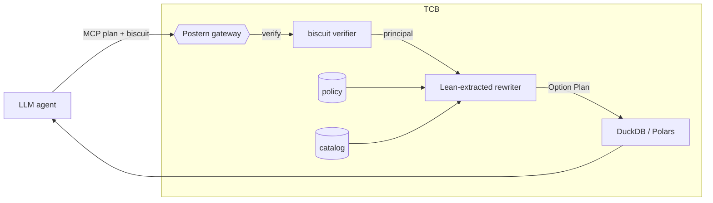

# Introduction

A *data lakehouse* is an analytic substrate that consolidates
multiple upstream operational sources via extract-transform-load
(ETL) pipelines into a single columnar store — typically Parquet
on object storage, queried in-process by DuckDB [@duckdb].
Recent deployments couple this substrate with LLM agents that
issue dataframe queries directly, mediated by tool-call protocols
such as the Model Context Protocol [@mcp]. Indirect-prompt-
injection studies [@agentdojo2024; @camel2025] establish that the
agent must be treated as adversarial. The conjunction raises an
access-control question that pre-LLM database access-control
mechanisms were not designed to answer.

## Existing approaches

We summarise the two responses currently deployed in production,
and the limitation each one accepts.

**Row- and column-level security inside ACID-class databases.**
PostgreSQL row security policies [@rls-postgres] and equivalents
in other transactional engines bind authorization predicates to
relations inside one engine instance. In a lakehouse setting
they are not directly applicable. Parquet is engine-agnostic;
DuckDB exposes no RLS surface; and policies expressed in the
upstream engine do not survive the ETL transformation, because
the catalog of the downstream store is structurally distinct from
that of the source. Reconstructing equivalent restrictions
external to the originating RDBMS demands per-engine adapters and
per-source policy duplication, which historically scales poorly
with the number of sources and the rate of policy churn.

**Tenant segregation.** Where the previous approach fails,
deployments default to *physical* partitioning: per-tenant or
per-department object-storage prefixes queried by disjoint engine
instances. The arrangement enforces the per-source perimeter by
absence rather than by construction, and forfeits the lakehouse's
primary technical motivation — joins and aggregations across
sources that were previously siloed. The result is a data silo
under the lakehouse label.

## A property gap

We restate the underlying mismatch precisely. Fix upstream
sources $S_1, \ldots, S_n$ with access-control denotations
$A_1, \ldots, A_n$ over their respective schemas, and let
$L = \bigcup_i S_i$ denote the materialised lakehouse. The
authorization denotation $A_L$ of $L$ is determined by the
ingest service account's IAM role alone; the originals
$\{A_i\}$ admit no semantic representative in $A_L$ once
materialisation has occurred. The effective permission of an
agent issuing a plan against $L$ is therefore the *union*
$\bigcup_i \mathit{perm}_{A_i}$ of upstream principals'
permissions, not the *intersection* under the querying
identity. When channel ACLs, field-level security, and
customer-scoped tokens collapse to a single service-account role
at ingest, an indirect-prompt-injected agent inherits the read
surface of the ingest service.

## Approach

We investigate a third point in the design space: a
*plan-level rewriter* mediating every read against a column-grant
policy. We pose two requirements. (1) The rewriter's
correctness — every accepted plan respects the policy — should
admit a mechanised proof, on the grounds that this is the
property most readily verified statically and most readily
falsified by an indirect-prompt-injected agent in deployment.
(2) The values that the rewriter releases should remain bounded
once they cross the gateway boundary, both lexically and in the
operations the agent's code may perform with them.

We address (1) in Lean~4: a Plan IR, a column-grant policy
language, and a rewriter
$\mathrm{rewrite} : \mathit{Catalog} \to \mathit{Policy} \to
\mathit{Principal} \to \mathit{Plan} \to \mathit{Option}\
\mathit{Plan}$, with nine theorems established without `sorry`
(§4). We address (2) in Rust, mechanising in the type system a
weaker analog of capture-checking [@capabilities-agents-2026]:
sealed capability tokens whose construction is private to the
gateway, branded by an invariant scope lifetime, and consumed at
opaque-receipt sinks (§3). The two layers compose without
re-verifying each other's trusted base.

## Contributions

1. A Plan IR ($\mathit{Scan}$/$\mathit{Project}$/$\mathit{Filter}$),
   a column-grant policy language, and a rewriter, mechanised in
   Lean~4 [@lean4]. The development comprises nine
   `sorry`-free theorems: output-column soundness, filter-predicate
   soundness, schema subset, idempotence under repeated
   application, monotonicity in the policy, two no-new-column
   lemmas, and explicit-refusal lemmas for unknown relations and
   for filter predicates over forbidden columns (§4). Axiom
   dependencies are audited per theorem and bounded by `propext`
   and `Quot.sound`; two theorems depend on none.

2. A Rust capability-tracking layer (`postern-guardrail`)
   implementing three composable mechanisms: sealed
   `Cap<'sc, C>` tokens whose construction is private to the
   crate, an invariant brand lifetime `'sc` enforced by
   `PhantomData<fn(&'sc ()) -> &'sc ()>` and gated by a
   universally-quantified scope combinator, and opaque-receipt
   sinks that consume both the `Cap` and the carrier `Tagged`
   without exposing the underlying value. Three lexical bypass
   attempts (forging `Cap`, projecting `Tagged::value`, escaping
   the brand) are pinned as `compile_fail` doctests. The
   agent-facing surface is `no_std`-compatible (§3).

3. A Rust implementation of the rewriter (`postern-core`)
   structurally mirroring the Lean reference, and a
   reference-conformance harness (`postern-diff`) that asserts
   byte-equivalence between the Rust output and the Lean
   reference on a corpus of 18 hand-curated cases (15 accept, 3
   refusal). We label the procedure *reference-conformance
   testing* rather than QuickCheck-style differential testing,
   reserving the latter term for property-based generation; the
   latter is among the open problems of §6.

4. A case study over the Kaggle `transactions-fraud-datasets`
   schema, with three principals (CRM, Card Operations, Fraud
   Risk) exercising PII redaction, cross-departmental refusal,
   and minimum-necessary disclosure (§5). Each row of the
   evaluation table corresponds to a corpus case driving the
   conformance harness.

# Plan IR

We state the IR before the threat model so §2 may reference its
operators directly. Plans are single-relation expressions built
from three constructors:
$$
  \mathit{Plan} \;::=\; \mathit{Scan}(r) \mid \mathit{Project}(\mathit{Plan}, \mathit{cs}) \mid \mathit{Filter}(\mathit{Plan}, c)
$$
where $r \in \mathit{Relation}$, $c \in \mathit{Column}$, and
$\mathit{cs} \in \mathit{List}\ \mathit{Column}$. We write
$\sigma(q)$ for the output schema of plan $q$ under a catalog
$\mathit{cat}$, defined inductively:
$\sigma(\mathit{Scan}(r)) = \mathit{cat}(r)$;
$\sigma(\mathit{Project}(p, \mathit{cs})) = \sigma(p) \cap \mathit{cs}$;
$\sigma(\mathit{Filter}(p, c)) = \sigma(p)$. The asymmetry between
$\mathit{Project}$ (which alters the output schema) and
$\mathit{Filter}$ (which does not, despite reading $c$) is the
source of the *filter side-channel* discussed in §2.

# Threat model

The trusted computing base (TCB) consists of the gateway process
itself, the catalog $\mathit{cat}$ that it consults, the
plan-to-executor lowering step that hands the rewritten plan to
DuckDB, the principal extraction step that maps a verified
capability token to a $\mathit{Principal}$ string, and the
DuckDB + Parquet store. All other parties are untrusted.

| Component                                  | Trust | Justification                                                  |
| ------------------------------------------ | :---: | -------------------------------------------------------------- |
| LLM / agent planner                        |   ✗   | Susceptible to direct and indirect prompt injection.            |
| Agent-generated code                       |   ✗   | Composes upstream-tainted context with downstream effects.      |
| Capability tokens [@biscuit]               |   ~   | Trust contingent on the gateway's signature verification.       |
| Gateway process                            |   ✓   | Hosts the Lean-verified rewriter and the policy.                |
| Catalog $(r \mapsto \text{columns})$       |   ✓   | Assumed bound to the physical Parquet schema (§6).              |
| Plan-to-executor lowering                  |   ✓   | The rewritten plan is assumed honoured literally by DuckDB.     |
| Principal-string extraction                |   ✓   | A bug in token verification invalidates every theorem of §4.    |
| DuckDB + Parquet store                     |   ✓   | Standard storage-engine assumptions apply.                      |

The attacks within scope of the formal model are: (i) over-
projection of forbidden columns; (ii) filter on a forbidden
column (the side-channel addressed by `rewrite_filter_sound`);
(iii) scan of a relation absent from the catalog (addressed by
`rewrite_refuses_unknown`); (iv) cross-departmental reach by a
principal lacking matching grants; and (v) unknown principals,
which we treat fail-closed via the empty-allow convention.

The following are deliberately out of scope and discussed in §6:
aggregation and inference attacks; covert channels through
latency or row-count observation; multi-relation joins; biscuit
attenuation modelled inside the Lean proof; policy synthesis
from natural language; and the planner-to-executor lowering
step.

# Design

Postern compiles a single policy artifact to plan-level enforcement.



## Policy

A policy is a list of **column-grants** $\langle p, r, C \rangle$:
"principal $p$ may read columns $C$ on relation $r$". Multiple
grants for the same $(p, r)$ flat-union. Anything outside the
union is denied — fail-closed. **No deny-lists**: the policy
language is deliberately monotone grant-only, which makes policy
review additive (a new grant can only widen). Deny-lists and
attribute-based predicates are §6.

## Rewriter

```
rewrite cat P prin q :=
  if cat q.touched = [] then     none                          -- unknown relation
  else if ¬ q.filterCols ⊆ allow then  none                    -- forbidden filter col
  else
    some (Project q (q.schema cat ∩ allow))
  where allow := P.allowed prin q.touched
```

Post-hoc projection is the simplest algorithm that admits a clean
soundness proof. Predicate-pushdown variants can be verified
against this rewriter as a reference; we leave that to future work.

## Capability-bounded data flow

The rewriter of §3 (Layer 1) constrains what data reaches the
agent. A separate layer (henceforth *Layer 2*) constrains what
the agent's code may do with the values released. Odersky et al.
[@capabilities-agents-2026] propose Scala 3 capture-checking as a
type-level mechanism for this purpose: capabilities are
first-class program variables, and the compiler tracks each
function's *capture set* — the capabilities it may use — so that
agent-generated code cannot perform an effect for which it does
not hold a capability. Rust has no capture-checking. We
mechanise a weaker analog by composing three pure-Rust
constructions, each closing one face of the gap.

**Sealed capability tokens.** `Cap<'sc, C>` carries no public
constructor and contains a `Sealed` field whose constructor is
private to the crate. Forging a `Cap` is therefore a privacy
violation rejected at compile time (verified by a
`compile_fail` doctest in the crate). Carrier values
`Tagged<'sc, T, C>` likewise have a private `value` field;
the inner $T$ is unreachable by direct field access (also
verified by `compile_fail`).

**Invariant brand lifetime.** Both `Cap` and `Tagged` carry a
brand parameter $'sc$, made invariant by
$\texttt{PhantomData<fn(\&'sc ()) -> \&'sc ()>}$. The sole entry
point to the layer is a scope combinator
$$
\texttt{run<T, C, R, F>(value, f) -> R}
\quad\text{where}\quad
\texttt{F: for<'sc> FnOnce(Cap<'sc, C>, Tagged<'sc, T, C>) -> R},\;
\texttt{R: 'static}.
$$
The universal quantification of $'sc$ together with $R: 'static$
forces the closure's return type to be free of $'sc$, ruling out
any path by which a $\mathtt{Cap}$ or $\mathtt{Tagged}$ might
escape the scope. The construction is the same one used by
`ghost-cell` for branded references. A third `compile_fail`
doctest demonstrates that attempting to return the `Cap` from
the closure is rejected.

**Opaque-receipt sinks.** Carrier extraction is governed by a
fixed set of sink functions, each of which consumes both
$\texttt{Cap<'sc, C>}$ and $\texttt{Tagged<'sc, T, C>}$ and
returns a *receipt* type that contains no information derived
from $T$ beyond its serialised length:

```rust
pub fn to_llm<'sc, T, C, S>(cap: Cap<'sc, C>,
                            data: Tagged<'sc, T, C>,
                            serialize: S) -> LlmAck
  where S: FnOnce(T) -> String;
```

The agent has no public method that returns raw $T$; the prior
draft's `Tagged::release(cap) -> T` is removed in favour of
the sink interface above. The only operations on $\mathit{Tagged}$
that the agent's code can perform are `map` and `and_then`, both
of which preserve the brand and the kind.

**The agent-facing surface is `#![no_std]`.** The crate is
partitioned so that the gateway-side integration with
`postern-core` lives behind a `gateway` feature flag; the
agent-facing types and operations (`Cap`, `Tagged`, `run`,
`sinks`) depend only on `core` and `alloc`. A downstream agent
crate declaring `#![no_std]` and depending on `postern-guardrail`
with `default-features = false` therefore has no link-level
access to `std::println!`, `std::process::exit`, network sockets,
or filesystem APIs, and the only side-effect channels available
are those reached through the sanctioned sinks.

**Residual.** Inside a `map` closure body the agent has
temporary access to a value of type $T$; Rust does not bound
what that body may do with the value. Three classes of
side-channel survive: `panic!` with formatted strings, timing
observed by the host, and stash in thread-local storage when
$T: 'static$. We mitigate the obvious thread-move attack by
making both `Cap` and `Tagged` `!Send + !Sync` via the
`*const ()` phantom, but a determined adversary inside the agent
runtime is out of scope for the present construction. A
genuinely tight analog of capture-checking in Rust appears to
require either a custom lint over closure bodies or a Wasm-class
sandbox; both directions are discussed in §6.

# Formal model

The development is mechanised in `verifier/lean/Postern.lean`;
the per-theorem axiom set is reported by `CheckAxioms.lean`. We
write $\mathit{rewrite}\ \mathit{cat}\ P\ p\ q$ for the rewriter
applied to catalog $\mathit{cat}$, policy $P$, principal $p$, and
plan $q$. The output type is $\mathit{Option}\ \mathit{Plan}$;
$\mathit{none}$ denotes explicit refusal.

**Theorem 1 (output-column soundness, `rewrite_sound`).** For
every $\mathit{cat}, P, p, q, q'$, if
$\mathit{rewrite}\ \mathit{cat}\ P\ p\ q = \mathit{some}\ q'$,
then for every column $c \in \sigma(q')$,
$c \in P.\mathit{allowed}\ p\ \mathit{touched}(q)$.

**Theorem 2 (filter-predicate soundness, `rewrite_filter_sound`).**
Under the same hypothesis, every column read by a $\mathit{Filter}$
predicate inside $q'$ is also in
$P.\mathit{allowed}\ p\ \mathit{touched}(q)$. Theorems 1 and 2
together rule out the side-channel in which a principal lacking
read access to column $c$ uses it as a row selector without
projecting it.

**Theorems 3 and 4 (`rewrite_schema_subset`,
`rewrite_no_new_columns`).** The output schema is contained in
the input schema. Equivalently, $c \notin \sigma(q)$ implies
$c \notin \sigma(q')$.

**Theorem 5 (idempotence, `rewrite_idempotent`).** If
$\mathit{rewrite}\ \mathit{cat}\ P\ p\ q = \mathit{some}\ q'$ and
$\mathit{rewrite}\ \mathit{cat}\ P\ p\ q' = \mathit{some}\ q''$,
then $\sigma(q'') = \sigma(q')$ as sets. The rewriter is a
closure operator on schemas.

**Theorem 6 (monotonicity in the policy, `rewrite_monotone`).**
If $P.\mathit{allowed}\ p\ r \subseteq P'.\mathit{allowed}\ p\ r$
for every $p$ and $r$, then the output schema under $P$ is
contained in the output schema under $P'$. Strengthening the
policy can only widen the released set.

**Theorem 7 (touched-relation preservation, `rewrite_touched`).**
$\mathit{touched}(q') = \mathit{touched}(q)$.

**Theorem 8 (refusal under unknown relation,
`rewrite_refuses_unknown`).** $\mathit{cat}\ \mathit{touched}(q) = []$
implies $\mathit{rewrite}\ \mathit{cat}\ P\ p\ q = \mathit{none}$.
A relation absent from the catalog is rejected explicitly rather
than reduced to an empty output schema — relevant under catalog
drift, where the physical store may diverge from the catalog.

**Theorem 9 (refusal under forbidden filter,
`rewrite_refuses_forbidden_filter`).** If
$c \in \mathit{filterCols}(q)$ and
$c \notin P.\mathit{allowed}\ p\ \mathit{touched}(q)$, then
$\mathit{rewrite}\ \mathit{cat}\ P\ p\ q = \mathit{none}$. The
contrapositive of Theorem 2.

`CheckAxioms.lean` audits the axiom dependencies of each theorem.
The set is bounded by $\{\texttt{propext}, \texttt{Quot.sound}\}$,
Lean~4's foundational axioms; the proofs of `rewrite_touched` and
`rewrite_refuses_unknown` depend on no axioms. No proof uses
`sorry`, and no user-supplied `axiom` declarations are
introduced.

# Implementation and conformance testing

The Rust implementation in `prototype/crates/postern-core` mirrors
the Lean types and the $\mathit{rewrite}$ function structurally.
The conformance harness `postern-diff` consumes a JSON corpus
emitted by `lake exe postern-corpus` and asserts three equalities
per case: that the Rust outcome kind ($\mathit{accept}$ /
$\mathit{refuse}$) matches the Lean reference; that, on accept,
the rewritten plan, output schema, predicate read-set, and
touched relation are structurally equal to the Lean reference;
and that the input plan's $\mathit{filterCols}$ matches the Lean
auxiliary, independent of the rewriter.

JSON-corpus conformance is preferred to Lean-to-Rust extraction
on the grounds that the corpus interface is stable across
compiler-version churn in both languages and that divergence
manifests as a CI failure rather than a build failure.

The corpus comprises 18 cases: seven behavioural cases drawn
from the financial-institution scenario of §5, four refusal
regressions for known attack shapes
(filter-on-forbidden-column, unknown-relation, two nested
forbidden-filter variants), and seven policy-language edge cases
(empty policy, duplicate grants, catalog-absent columns,
case-sensitive principal, trailing-whitespace principal,
nonexistent project column, nested $\mathit{Project}$
narrowing). All eighteen pass on the current Rust
implementation.

# Evaluation: a financial institution with three principals

We evaluate the artifact on the Kaggle
`transactions-fraud-datasets` schema. The policy is reproduced
in `scenarios/financial-institution/policy.postern`; the
principal cases are summarised below.

| principal   | plan                                | outcome             | rewritten schema                       |
| ----------- | ----------------------------------- | ------------------- | -------------------------------------- |
| `CRM`       | `Scan users_data`                   | accept              | `id, name, region, age`                |
| `CRM`       | `Project [ssn,email]` over above    | accept              | `∅` (over-projection collapses)        |
| `CRM`       | `Filter on ssn`                     | **refuse**          | —                                      |
| `CardOps`   | `Scan users_data` (cross-dept)      | accept              | `∅` (no matching grant)                |
| `FraudRisk` | `Scan users_data`                   | accept              | `id, region` (minimum-necessary)       |
| `Marketing` | `Scan users_data` (unknown prin.)   | accept              | `∅` (empty allow)                      |
| `CRM`       | `Scan credit_bureau_imports`        | **refuse**          | — (unknown relation)                   |

Each row corresponds to a corpus case in the conformance harness;
the rows annotated $\mathit{refuse}$ exercise Theorems 8 and 9 of
§4.

# Related work

We are not aware of prior work that establishes a mechanised
soundness theorem for a plan-level rewriter in an LLM-agent-
facing lakehouse setting. The closest landmarks fall into four
groups.

*Verified authorization decision procedures.* Cedar
[@cedar2024] formalises and proves the soundness of an
authorization-decision function in Lean. The axis of
verification differs from ours: Cedar establishes
$\mathrm{authorize}(\mathit{request}) \in \{\mathit{allow},
\mathit{deny}\}$ correctly classifies a per-call request,
whereas we establish that the *output of a plan transformation*
is contained in the policy-allowed set. The two are
complementary; we adopt the Cedar style of Lean-mechanised
denotational semantics for our policy.

*Capability-based enforcement runtimes.* SEAL [@seal2023]
provides capability-based access control for analytic
workloads at the runtime level; the policy core is not
mechanically verified. Our development is the dual: the policy
core is verified, and the runtime is correspondingly lighter.
Biscuit [@biscuit] provides the deployed capability-token
distribution mechanism we assume on the front end.

*Information-flow control for database-backed applications.*
Jeeves [@jeeves2012], Jacqueline [@jacqueline2016], and the
faceted-execution line [@faceted-haskell] enforce IFC inside
ORM-backed applications using a faceted-value runtime
discipline. They predate the LLM-agent threat model and do not
target the lakehouse setting; we view them as the closest
PL-side relatives of Layer 2 of our development.

*Defences for LLM-agent prompt injection.* AgentDojo
[@agentdojo2024] and CaMeL [@camel2025] develop capability-flow
defences at the agent boundary. Our development is
complementary: the rewriter of §3–§4 enforces a policy at the
lake-facing boundary on plans; their constructions enforce
analogous properties on the agent's own emitted code. Closest
to our Layer 2 specifically, Odersky et al.
[@capabilities-agents-2026] propose Scala~3 capture-checking as
the type-level mechanism for tracking capabilities through
agent code; we adapt the same intuition under Rust's weaker
type-system commitments (§3).

*Deployed alternatives we improve upon.* PostgreSQL row
security policies [@rls-postgres] and equivalent CLS facilities
require per-engine integration and do not compose across the
heterogeneous ingest paths typical of lakehouse deployments.
Open Policy Agent [@opa-rego] is general-purpose but does not
reason about query outputs at the plan level. Tenant
segregation forfeits cross-source analytics and is the silo
case we discuss in §1.

# Open challenges and future work

Three extensions of the Lean development are the natural next
research questions.

*Cross-relation joins.* The Plan IR is single-relation. The
Rust implementation handles joins by per-leg rewriting but the
composition is not under proof. The conjecture is a theorem of
the form
$$
  \mathit{rewrite\_sound\_join} :
  \mathit{accept}(q_1) \wedge \mathit{accept}(q_2) \implies
  \sigma(\mathit{rewrite}(\mathit{Join}(q_1, q_2))) \subseteq
  \bigcup_i P.\mathit{allowed}\ p\ \mathit{touched}(q_i)
$$
on a Plan IR extended with a $\mathit{Join}$ constructor. The
join-key leak — joining on a column $c$ without projecting it,
which leaks $c$'s value distribution — mirrors the filter
side-channel and admits the analogous coverage condition.

*Aggregation with a differential-privacy boundary.* A
principal may be permitted to read $\mathrm{SUM}(\mathit{amount})$
without permission to read individual rows. The rewriter
extension here is straightforward in shape but admits a
non-trivial soundness statement once the differential-privacy
boundary is parameterised; SEAL [@seal2023] and the faceted
line [@faceted-haskell] are the closest reference points.

*Capability attenuation inside the proof.* The Lean development
takes $\mathit{Principal}$ as a flat string and assumes the
gateway has already verified the bearer of a biscuit token.
Modelling biscuit's Datalog-based attenuation, expiry, and
audience checks inside the Lean proof lifts the principal-
extraction row out of the trusted base — a substantial
strengthening of the artifact's overall claim. Adjacent open
problems include catalog-integrity attestation and plan-
integrity in transit.

# Reproducibility

```
verifier/lean/   Lean 4 spec + theorems + corpus emitter
prototype/       Rust workspace: postern-core, postern-diff
scenarios/       Financial-institution case study
paper/           This document
scripts/         reproduce.sh — chains everything
```

Toolchains: **Lean 4.29.1** (pinned in `verifier/lean/lean-toolchain`),
**Rust stable** (tested 1.93). Single command:

```sh
scripts/reproduce.sh
```

Expected output ends with
`18/18 cases pass (Lean reference == Rust impl)` and an axiom
audit showing only `propext` and `Quot.sound`. Runs in under
two minutes on an M-series Mac on a warm cache.

# References

::: {#refs}
:::
