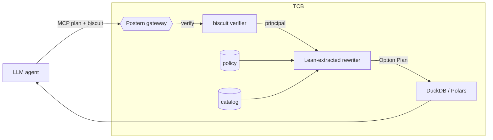

# Introduction

Two shifts in production agentic systems motivate this work. **First**,
context for an LLM agent is no longer drawn from a single SaaS API
under that SaaS's own RBAC; it is drawn from a centralized
lakehouse (DuckDB over Parquet on S3 [@duckdb]) populated by
Airbyte-style ETL and long-term memory services [@mem0].
**Second**, agents *issue* the dataframe query themselves — through
MCP tools [@mcp] — rather than receiving rows hand-picked by a human
analyst.

The result is a concrete authorisation collapse. A 2024 deployment
might hold Slack threads behind channel ACLs, Salesforce contacts
behind field-level security, and Stripe charges behind customer-
scoped API tokens; the 2026 deployment lands all three in one
Parquet bucket queried by a single DuckDB service account, with no
remaining channel / field / customer boundary. An agent that can
issue a query inherits the *union* of the three upstreams'
permissions, not the intersection — and the lake-side IAM role is
the only thing standing between an indirect-prompt-injected agent
and the merged dataset.

This paper restores that boundary by inserting a verified gateway
between agents and the lake. The gateway holds a single policy
artifact and **rewrites** every plan it sees so that *both the
output schema and the predicate read-set* are contained in what
the policy permits. We treat the gateway as the trusted base;
everything beyond it (LLM, agent-generated code) is untrusted, and
recent benchmarks for indirect prompt injection [@agentdojo2024;
@camel2025] confirm that "untrusted" is the right default.

## Contributions

1. A small, fully-mechanized core in **Lean 4** [@lean4]: a Plan IR
   (`Scan`/`Project`/`Filter`), a column-grant policy language, and
   a `rewrite : Catalog → Policy → Principal → Plan → Option Plan`
   function. *Nine* `sorry`-free theorems span output-column
   soundness, filter-predicate soundness, schema subset, monotonicity
   in policy, idempotence, and explicit-refusal lemmas for unknown
   relations and forbidden filter columns (§4).

2. A **Rust prototype** (`postern-core`) mirroring the Lean types
   and rewriter. Target deployment: a Polars [@polars] / DuckDB
   gateway with biscuit-token [@biscuit] capability authentication.

3. A **reference-conformance harness** (`postern-diff`). Lean emits
   a JSON corpus of `(catalog, policy, principal, plan,
   expected_outcome)` tuples; the Rust side replays each case and
   asserts byte-equivalence of the resulting `Option<Plan>`. 18 / 18
   cases pass on the demo corpus, including three refusal regressions
   for known attack shapes. We label this *conformance testing*, not
   QuickCheck-style differential testing: the corpus is hand-curated,
   property-based generation is future work (§6).

4. A **financial-institution case study** (Kaggle
   `transactions-fraud-datasets`, 3 principals
   — CRM, CardOps, FraudRisk) exercising PII redaction,
   cross-department refusal, and minimum-necessary disclosure (§5).

# Plan IR (preview)

For §2 and §3 to be readable in one pass we state the IR up front:

```
Plan ::= Scan(rel)
       | Project(plan, cols)
       | Filter(plan, col)
```

`Project(p, cs)` keeps only `cs ∩ schema(p)`. `Filter(p, c)` is
row-only — the column `c` is *read* by the predicate but does not
appear in the output schema. This asymmetry is what makes the
filter side-channel real.

# Threat model

We assume a trusted gateway holding the policy and the
cryptographic root for capability tokens. Everything else is
untrusted:

| Component                                  | Trust | Notes                                                          |
| ------------------------------------------ | :---: | -------------------------------------------------------------- |
| LLM / agent (planner)                      |   ✗   | Jailbreakable; may emit hostile SQL / dataframe ops.            |
| Tool-generated code                        |   ✗   | Indirect injection from retrieved context; supply chain.        |
| Capability tokens [@biscuit]               |   ~   | Trusted *only* once the gateway verifies the signature.         |
| Gateway process (Postern, this paper)      |   ✓   | TCB. Holds the Lean-verified rewriter and the policy.           |
| **Catalog** (relation → columns map)       |   ✓   | TCB. Assumed bound to the physical Parquet schema (§6).         |
| **Plan-to-executor lowering**              |   ✓   | TCB. We trust the rewritten plan is honoured literally by DuckDB. |
| **Principal-string extraction from token** |   ✓   | TCB. A buggy biscuit verifier defeats every theorem below.      |
| DuckDB + Parquet store                     |   ✓   | TCB.                                                            |

**In-scope attacks the rewriter defeats.** (i) Over-projection of
forbidden columns. (ii) Filter on a forbidden column (the
`WHERE ssn = ?` side-channel — closed by
`rewrite_filter_sound`). (iii) Scan of an un-attested relation
(closed by `rewrite_refuses_unknown`). (iv) Cross-department reach
by a principal with no matching grants. (v) Unknown principals
(fail-closed: empty allow ⇒ empty schema).

**Out of scope (paper §6).** Aggregation / inference attacks;
covert channels through query latency or row counts; multi-relation
joins; biscuit-token attenuation inside the proof; policy
synthesis from natural language; the planner→executor lowering
step.

# Design

Postern compiles a single policy artifact to plan-level enforcement.



## Policy

A policy is a list of **column-grants** $\langle p, r, C \rangle$:
"principal $p$ may read columns $C$ on relation $r$". Multiple
grants for the same $(p, r)$ flat-union. Anything outside the
union is denied — fail-closed. **No deny-lists**: the policy
language is deliberately monotone grant-only, which makes policy
review additive (a new grant can only widen). Deny-lists and
attribute-based predicates are §6.

## Rewriter

```
rewrite cat P prin q :=
  if cat q.touched = [] then     none                          -- unknown relation
  else if ¬ q.filterCols ⊆ allow then  none                    -- forbidden filter col
  else
    some (Project q (q.schema cat ∩ allow))
  where allow := P.allowed prin q.touched
```

Post-hoc projection is the simplest algorithm that admits a clean
soundness proof. Predicate-pushdown variants can be verified
against this rewriter as a reference; we leave that to future work.

# Formal model

Mechanized in `verifier/lean/Postern.lean`. Build with `lake build`;
the per-theorem axiom set is reported by `CheckAxioms.lean`.

**Theorem 1 (`rewrite_sound`).** If
$\texttt{rewrite}\ cat\ P\ prin\ q = \texttt{some}\ q'$, then for
every column $c$ in $q'\!.\texttt{schema}\ cat$,
$c \in P.\texttt{allowed}\ prin\ q.\texttt{touched}$. *Every
column appearing in the rewritten plan's output schema is one the
policy permits.*

**Theorem 2 (`rewrite_filter_sound`).** Under the same accept
hypothesis, every column read by a `Filter` predicate inside $q'$
is policy-allowed. **Closes the side-channel** in which a
principal who cannot *read* `ssn` could still filter on it.

**Theorem 3 (`rewrite_schema_subset`)** and **Theorem 4
(`rewrite_no_new_columns`).** The rewriter only ever removes
columns — never invents them.

**Theorem 5 (`rewrite_idempotent`).** Rewriting twice admits the
same column set. The rewriter is a closure operator on schemas.

**Theorem 6 (`rewrite_monotone`).** If $P \subseteq P'$ (multiset
inclusion on allowed columns), then the output schema under $P$ is
contained in that under $P'$ — strengthening the policy can only
widen the output.

**Theorem 7 (`rewrite_touched`).** `q'.touched = q.touched`.
*Touched relation is preserved.*

**Theorem 8 (`rewrite_refuses_unknown`).** `cat q.touched = []`
implies `rewrite ... = none`. **An unknown relation is never a
silently empty schema** — explicit refusal protects against
catalog drift attacks.

**Theorem 9 (`rewrite_refuses_forbidden_filter`).** If
`c ∈ q.filterCols` and `c ∉ allow`, then `rewrite ... = none`.
Companion to Theorem 2.

`CheckAxioms.lean` reports per-theorem axiom dependencies. The set
is bounded by `{propext, Quot.sound}` — Lean 4's built-in
foundational axioms; two theorems (`rewrite_touched`,
`rewrite_refuses_unknown`) depend on *no* axioms. There is no
`sorry`, no user-supplied `axiom`.

# Implementation and conformance testing

The Rust prototype (`prototype/crates/postern-core`) mirrors the
Lean types and `rewrite` literally. The conformance harness
(`postern-diff`) reads a JSON corpus from `lake exe postern-corpus`
and asserts:

1. Outcome kind (`accept` / `refuse`) matches.
2. On accept: rewritten plan equals Lean's reference structurally;
   so do `schema(cat)`, `filter_cols`, and `touched`.
3. The input plan's `filter_cols` matches Lean's `Plan.filterCols`
   (sanity-checks the IR helper independent of the rewriter).

We chose JSON-corpus conformance over Lean → Rust extraction
because the corpus interface is stable across compiler churn and
surfaces divergence as a CI signal, not a build break.

**Corpus shape.** 18 cases: 7 behavioural (the §5 demo), 4
refusal regressions for known attacks, 7 policy-language edge
cases (empty policy, duplicate grants, catalog-absent columns,
case sensitivity, trailing-whitespace principal, nonexistent
project column, nested Project narrowing). All 18 pass.

# Demo: a financial institution with three departments

Kaggle `transactions-fraud-datasets`. Policy in
`scenarios/financial-institution/policy.postern`; the load-bearing
rows:

| principal   | plan                                | outcome             | rewritten schema                       |
| ----------- | ----------------------------------- | ------------------- | -------------------------------------- |
| `CRM`       | `Scan users_data`                   | accept              | `id, name, region, age`                |
| `CRM`       | `Project [ssn,email]` over above    | accept              | `∅` (over-projection collapses)        |
| `CRM`       | `Filter on ssn`                     | **refuse**          | —                                      |
| `CardOps`   | `Scan users_data` (cross-dept)      | accept              | `∅` (no matching grant)                |
| `FraudRisk` | `Scan users_data`                   | accept              | `id, region` (minimum-necessary)       |
| `Marketing` | `Scan users_data` (unknown prin.)   | accept              | `∅` (empty allow)                      |
| `CRM`       | `Scan credit_bureau_imports`        | **refuse**          | — (unknown relation)                   |

Each row is a corpus case; "refuse" rows exercise Theorems 8 / 9.

# Related work

No prior system, to our knowledge, proves soundness of a
plan-level rewriter for an LLM-agent-facing lakehouse. The closest
landmarks:

- **Cedar** [@cedar2024] proves authorization-decision soundness
  for per-call API authorization, also in Lean. The axis is
  different: Cedar verifies "may this principal call read?",
  Postern verifies "is the dataframe the executor sees contained
  in what the policy permits?".
- **SEAL** [@seal2023] gives capability-based enforcement at
  runtime; the policy core itself is unverified. Postern is the
  inverse — verified policy core, lighter runtime — and pairs with
  biscuit [@biscuit] for capability distribution.
- **Jeeves / Jacqueline** [@jeeves2012; @jacqueline2016] and the
  faceted-execution line [@faceted-haskell] enforce IFC in ORM-
  backed apps via a heavyweight faceted-value runtime. They
  predate the LLM-agent threat model and ship no Lean artifact.
- **Postgres RLS** [@rls-postgres] and **OPA / Rego** [@opa-rego]
  are the deployed baselines. RLS is per-database with no formal
  guarantee beyond `EXPLAIN`; OPA is general-purpose but does not
  reason about query outputs.
- **AgentDojo** [@agentdojo2024] and **CaMeL** [@camel2025] argue
  for capability-flow defences against indirect prompt injection
  at the *agent* layer. Postern is the complementary lake-side
  enforcement point.

# Open challenges and future work

The Lean spec is narrow on purpose. Three load-bearing extensions
remain.

1. **Joins under proof.** The IR is single-relation; the Rust impl
   handles joins by per-leg rewriting but is not under proof. The
   natural next theorem is
   `rewrite_sound_join`: for `Join(q₁, q₂)`, the rewritten output
   columns are contained in the union of per-leg allowed sets. The
   hard case is the join-key leak — joining on `ssn` without
   projecting it mirrors the filter side-channel and needs the
   same join-key-coverage condition.

2. **Aggregation, with a differential-privacy boundary.** A
   principal may be allowed `SUM(amount)` without individual-row
   visibility. Lifting the rewriter to aggregations is open; SEAL
   and the faceted line [@seal2023; @faceted-haskell] are the
   closest reference points.

3. **Biscuit attenuation inside the proof.** The current Lean
   spec sees a flat `principal : String`. Modelling biscuit's
   Datalog-based attenuation, expiry, and audience checks inside
   the proof lifts the principal-string-extraction row out of the
   TCB. Catalog integrity, plan integrity in transit, and NL →
   policy synthesis are further out but the same shape.

# Reproducibility

```
verifier/lean/   Lean 4 spec + theorems + corpus emitter
prototype/       Rust workspace: postern-core, postern-diff
scenarios/       Financial-institution case study
paper/           This document
scripts/         reproduce.sh — chains everything
```

Toolchains: **Lean 4.29.1** (pinned in `verifier/lean/lean-toolchain`),
**Rust stable** (tested 1.93). Single command:

```sh
scripts/reproduce.sh
```

Expected output ends with
`18/18 cases pass (Lean reference == Rust impl)` and an axiom
audit showing only `propext` and `Quot.sound`. Runs in under
two minutes on an M-series Mac on a warm cache.

# References

::: {#refs}
:::
