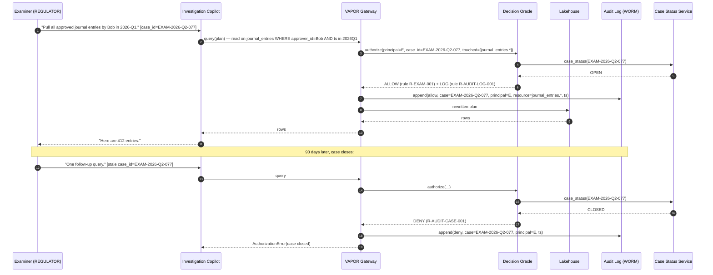

# Scenario 08 — Regulator audit / case-bound investigation

## Setting

A regulator (Fed examination team) opens examination case
`EXAM-2026-Q2-077`. Under the engagement, named examiners receive
read access to specific tables for the duration of the case. Inside
the bank, the Compliance team's "Investigation Copilot" reads broadly
across departments but only with an active `case_id`. After the case
closes, no future read using that `case_id` is permitted.

The audit log is the **proof** that controls held — it is the artifact
that gets shown to the regulator at close-out and at the annual
Section 404 attestation.

## What must hold

- Every read by a `COMPLIANCE` or `REGULATOR` principal carries a
  `context.case_id`; reads without one are rejected.
- The audit log is append-only, retention-locked, and *outside the
  agent's write path*.
- A close-out tool can mark a case `closed_at`; subsequent reads with
  that case_id are rejected.
- A regulator query of the form *"show me every column-Y access by
  principal-X in 2026-Q1"* is one SELECT against the audit log.

## Policy fragment

```vapor
@rule R-AUDIT-CASE-001
forbid read, aggregate on *
  when principal.department in [COMPLIANCE, REGULATOR]
   and (context.case_id is null
        or case_status(context.case_id) != OPEN)

@rule R-AUDIT-LOG-001
always log read, aggregate, approve
  when principal.department in [COMPLIANCE, REGULATOR]
  with { case_id, principal.id, resource_path, ts, rule_id, decision }
```

`always log` is a new effect (alongside `permit` / `forbid` / `mask`)
that fires on *every* decision matching the rule, regardless of allow/
deny outcome. Audit-log soundness is a Lean obligation in itself
(see below).

## Sequence (Mermaid)



## Lean obligations

### `Log.complete`

> Every call to the decision oracle produces exactly one log record;
> log records are an injective function of (oracle inputs, oracle
> outputs).

Statement (informal):

```
∀ req. ∃! rec. AuditLog.append(rec) was called during authorize(req)
∧ rec = encode(req, decision(req), matched_rules(req), now)
```

This is the *non-repudiation* property. The bank can prove to the
regulator that **no read happened that isn't in the log** — because
the only path to the lake is through the gateway, and the only path
through the gateway calls the oracle, and the oracle is verified to
emit one log record per call.

### `Log.append_only`

The log sink supports only `append`. There is no `update` or `delete`
operation exposed to any principal. (In practice: S3 Object Lock in
compliance mode, or a Quorum-style WORM store. The Lean property is
that the gateway's API surface does not expose mutation; the
underlying store's WORM guarantee is delegated.)

## Why this is the artifact's strongest correctness story

In the SaaS-startup scenarios, the audit log is a nice-to-have. For a
bank, the audit log is the **regulatory deliverable**. By making it a
verified property of the decision oracle, VAPOR moves audit from
"trust the operator" to "follows from the design."

Contrast with the status quo:

- **Database audit logs** (Postgres `pgaudit`, Snowflake account
  usage) — log queries, not policy decisions. To answer "did Alice
  ever read column Y", the auditor must replay every query through a
  parser. Some queries are dynamic SQL — irreversible.
- **Application-layer logging** — depends on every code path
  remembering to call the logger. Notoriously incomplete.
- **VAPOR** — the gateway is the chokepoint; the oracle is the
  decision; the log entry is a return value of the oracle. There is
  no "forgot to log" path.

## Eval angle

- Time to answer a regulator query: minutes (one SQL on audit log) vs
  weeks (forensic engagement) in the status quo.
- Completeness of the audit log: formally proved (`Log.complete`) vs
  best-effort.
- Cost of adding a new "must be logged" category: 1 rule line vs new
  schema + new logger + redeploy.
