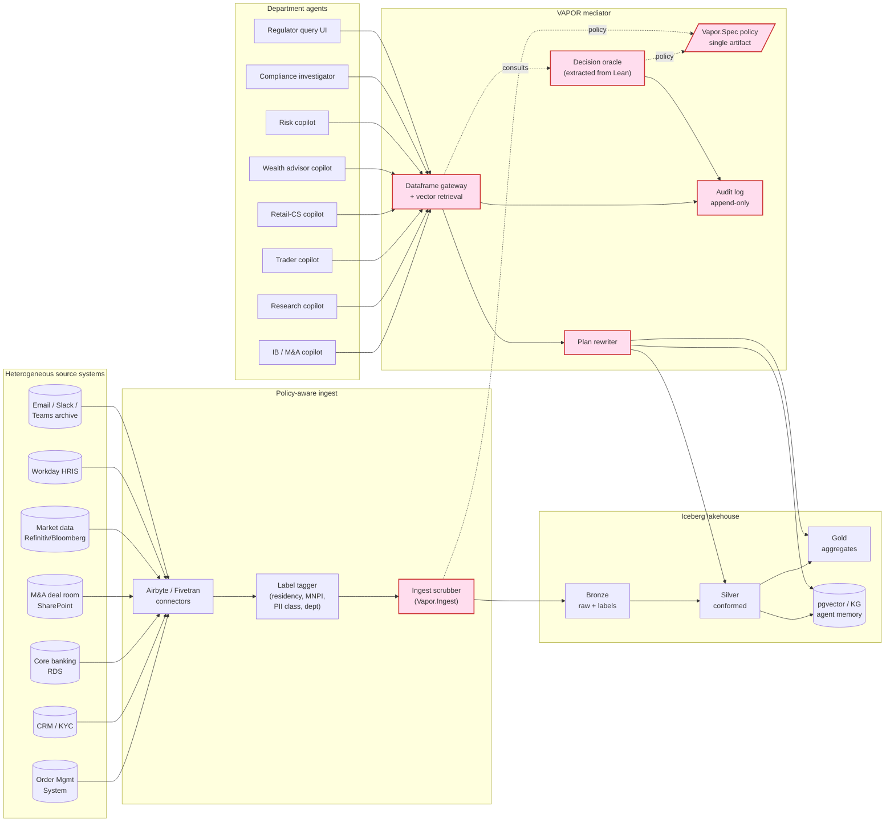

# Case study: VAPOR for a multi-department financial institution

> Second eval vertical (alongside the SaaS-startup scenarios 01–04). This
> case study stress-tests VAPOR against a domain whose access-control
> requirements predate LLM agents by decades — and whose regulators
> require auditable, mechanical enforcement.

A mid-size universal bank ("BankCo") deploys department-specific LLM
agents to compress analyst toil, automate first-pass research, and
power customer self-service. The same data-lakehouse architecture
that makes those agents possible is also the failure mode: once
trading, research, retail, and HR data live in one Iceberg cluster,
the bank's *Chinese walls*, *MNPI controls*, *MiFID II surveillance
records*, *GDPR data-residency obligations*, and *SOX segregation of
duties* must all be enforced by **one** policy layer or they will be
enforced by none.

VAPOR's pitch in this setting: a single Lean-verified `Vapor.Spec`
expresses every wall, residency boundary, masking rule, and aggregation
threshold; the gateway rewrites or rejects every agent query against
that one artifact; the audit log is a byproduct of the decision oracle.

## Departments modeled

| Dept | Agent | Reads | Forbidden / restricted |
|---|---|---|---|
| **Investment Banking (M&A advisory)** | Deal-room copilot | Deal pipeline, client filings, comparables | Trading book, retail customers, research drafts |
| **Equity Research** | Research copilot | Public filings, market data, prior reports | M&A pipeline, trader positions (MNPI wall) |
| **Sales & Trading (Equities/FICC)** | Trader copilot | Order book, market data, position book | M&A pipeline, unpublished research, retail PII |
| **Retail Banking** | Customer-service copilot | Single customer's accounts/transactions on demand | Other customers; aggregate cross-customer reads |
| **Private / Wealth** | Advisor copilot | HNW client portfolios + KYC for own book | Other advisors' clients; trading desk MNPI |
| **Risk** | Risk copilot | Cross-firm aggregates (VaR, exposure) | Individual customer rows (PII); raw trade-level for non-risk purpose |
| **Compliance / Legal** | Investigation copilot | Everything **with case-justification + audit** | Reads without `context.case_id` are rejected |
| **HR** | People-ops copilot | Employee data, compensation, performance | Customer data; trading positions |
| **Finance / Treasury** | Treasury copilot | Firm-level GL, funding | Individual customer PII; trading-desk MNPI |
| **IT / Engineering** | Platform copilot | Infrastructure metrics, ingest logs, schema | Customer rows; transaction values; HR comp |
| **Quant / Data Science** | Modeling copilot | Aggregated and anonymized features | Raw rows; PII; identifiable trades |
| **Regulator (read-only)** | (no agent) — direct query | Scoped to subpoena / examination scope | Logged with retention; reason mandatory |

## Compliance regimes in scope

- **MNPI / Chinese walls** — physical-org separation expressed as
  policy predicates over (principal.dept × resource.deal_pipeline ×
  time-window-around-announcement).
- **MiFID II** — best-execution records, communications surveillance;
  all reads from trader agents are timestamped + retained.
- **GDPR / CCPA** — EU/CA customer rows physically reside in regional
  storage; policy enforces residency tags; RTBF wired into a `mask
  using tombstone` rewrite.
- **PCI-DSS** — card PAN / CVV never visible to any agent; only last-4
  via `mask` and only to authorized roles.
- **SOX / segregation of duties** — same principal cannot
  *initiate* and *approve* the same financial action; expressed as a
  cross-table predicate.
- **BCBS 239** — risk data aggregation principles. Risk-team
  aggregate predicates carry minimum-granularity constraints.
- **GLBA** — financial privacy notices and information sharing limits.
- **FINRA Rule 3110** — supervisory framework; supervisor-principal
  privileges scoped to *their* direct reports' communications only.
- **Volcker / Dodd-Frank** — prop-trading data flows separated from
  client-flow desks.

## Architecture (Mermaid)

Pink boxes are the TCB. The same `Vapor.Spec` artifact drives ingest
(`ISCRUB`) and egress (`REW`); the audit log is a byproduct of every
oracle call.

## Scenario index

| # | File | Compliance regime exercised | Lean obligation |
|---|---|---|---|
| 05 | `05-chinese-wall.md` | MNPI / Chinese walls | `Rewriter.sound`, time-window predicates |
| 06 | `06-cross-border-residency.md` | GDPR / data residency | Residency tag propagation, ingest+egress composition |
| 07 | `07-segregation-of-duties.md` | SOX, FINRA 3110 | Cross-row predicate on `(initiator, approver)` |
| 08 | `08-regulator-audit.md` | Audit trail mandates | Decision oracle log soundness; *non-repudiation* |

The DSL fragments these scenarios share live in `policy.vapor`.

## Why this case study matters for the paper

1. **Compliance is not a feature flag — it's a multi-axis lattice.**
   Banks already enforce these controls via duct-tape: per-system
   ACLs + bespoke ETL filters + manual periodic audits + after-the-fact
   forensics. VAPOR demonstrates the lattice as a *single typed
   artifact*.
2. **MNPI Chinese walls are the textbook case the data-lake design
   pattern breaks.** Trading and IB historically had physically
   separate systems. Once a lake unifies them, only a policy layer
   stands between catastrophe and quarterly results.
3. **The regulator path doubles as the artifact's strongest
   correctness story.** Every read carries a justification; the audit
   log is the proof obligation made externally visible. Cedar can't
   tell you "show me every time principal X observed column Y" — VAPOR
   can, because the oracle is the chokepoint.
4. **BCBS 239's "risk data aggregation" principles map cleanly onto
   our `aggregate` predicates** — an emerging-regulator alignment story
   that strengthens the paper's relevance.
