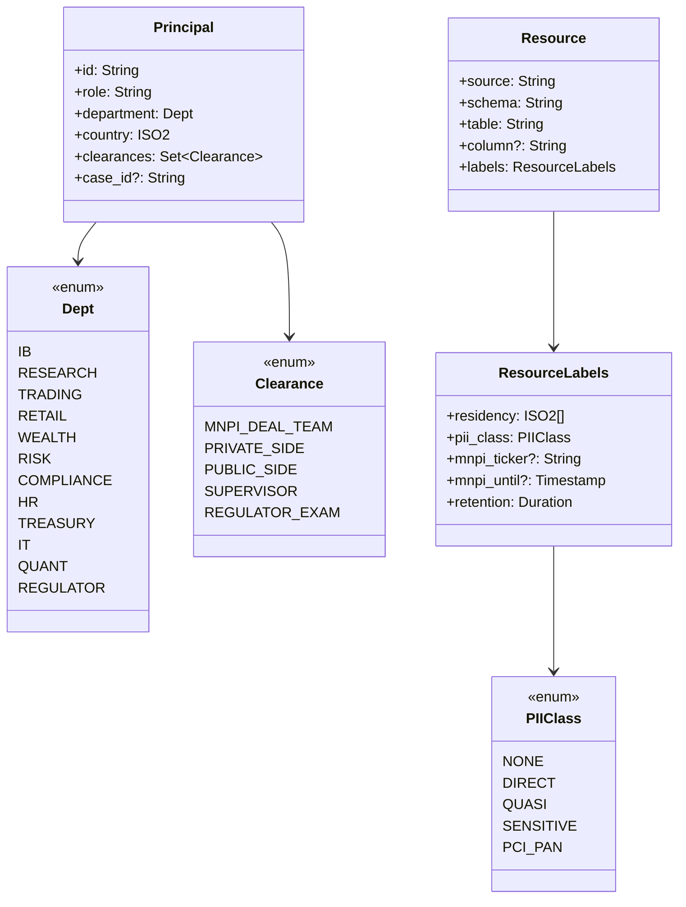
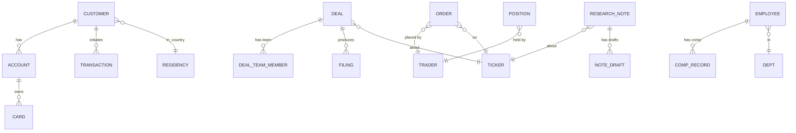

# Departments × data assets — class diagram

The bank's data model in scope for this case study. Drives the policy
fragments in `policy.vapor`.

## Class diagram

## Data domains and example tables

## Resource labels in detail

Every Bronze-tier row carries a labels struct. The ingest connectors
(`Vapor.Ingest`) tag rows from the schema mapping or from a `LBL`
look-aside service. Labels then drive every downstream `permit` /
`forbid` / `mask` decision.

- `residency: ISO2[]` — countries this row may be processed in.
  Customer KYC for an EU resident: `residency = ["DE", "EU"]`.
- `pii_class: PIIClass`
  - `NONE` — corporate / market data
  - `DIRECT` — name, email, address
  - `QUASI` — DOB, postcode, gender (re-id risk)
  - `SENSITIVE` — health, beliefs, biometric (GDPR Art. 9)
  - `PCI_PAN` — full payment card number (never visible to any agent)
- `mnpi_ticker / mnpi_until` — if set, this row contains MNPI about
  the given ticker until the timestamp passes (typically: deal
  announcement + 30 days).
- `retention: Duration` — how long the record may persist (RTBF
  composes with this; deletion is `mask using tombstone`).

## Principal attributes — beyond role

VAPOR's `principal.cond` clauses can reference any attribute. For the
bank we add:

- `department` — the org-chart unit (drives the Chinese wall
  predicates).
- `country` — where the principal is acting from (for
  cross-border-controls; an EU employee accessing CA-resident data
  must clear a different bar).
- `clearances` — explicit grants (e.g. `MNPI_DEAL_TEAM` is added only
  when the employee is added to a specific deal's team, removed at
  announcement+30).
- `case_id` — required for `compliance` department reads; the audit
  log is keyed on `(principal, resource, case_id, timestamp)`.
